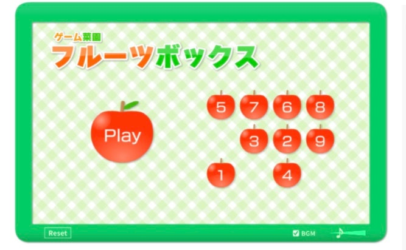

# sm25java
# 2025.07.01
# wskim
1. Java Training
2. Java Program
   1. OOP
   2. JVM
      1. JRE
      2. JDK

* 글자
  * 글자 
    * 글자
+ 글자
    + 글자
        + 글자

***
신규 라인
***
신규라인
<pre>
<code>
public class A{
    public static void main(){
    }
}
</code>
</pre>

[Google](https://www.google.com, "Google Link")

)
